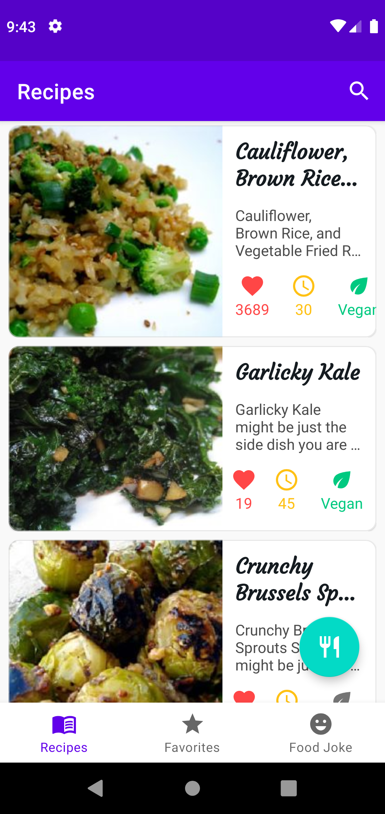
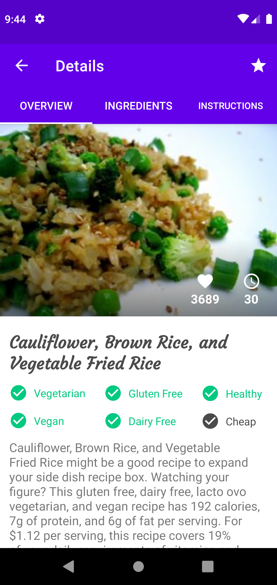
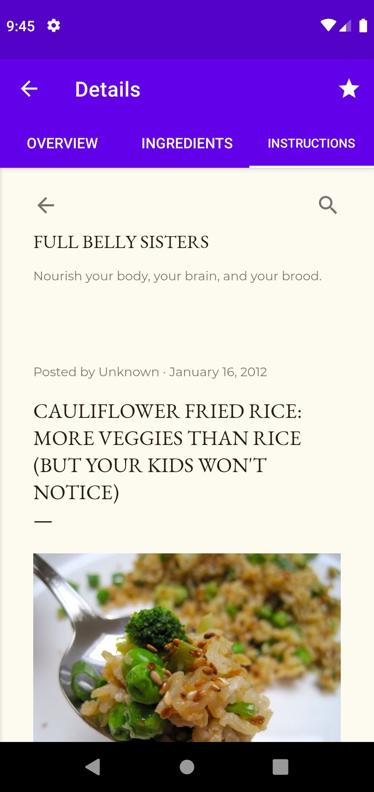
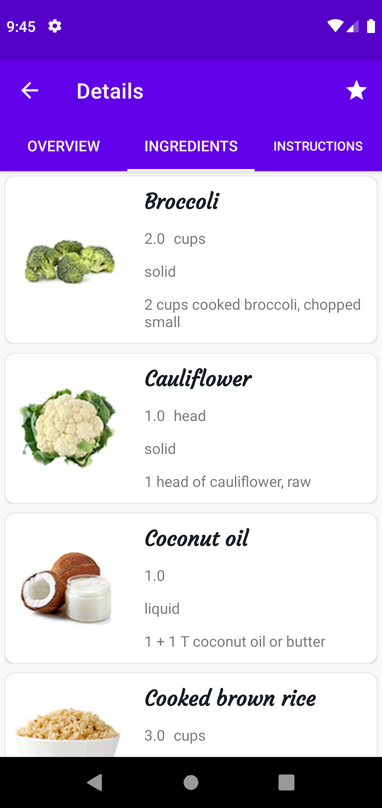
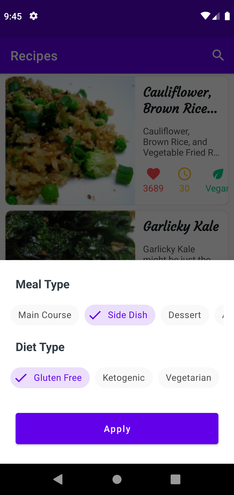
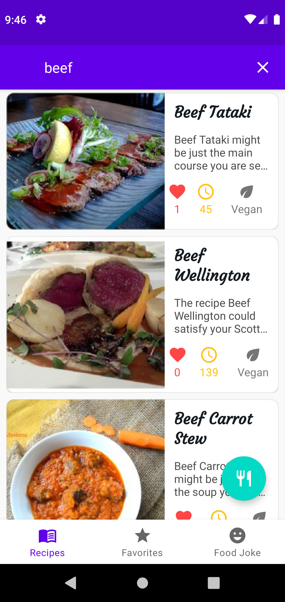
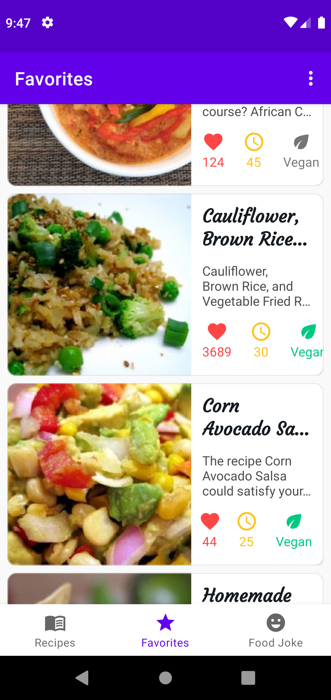
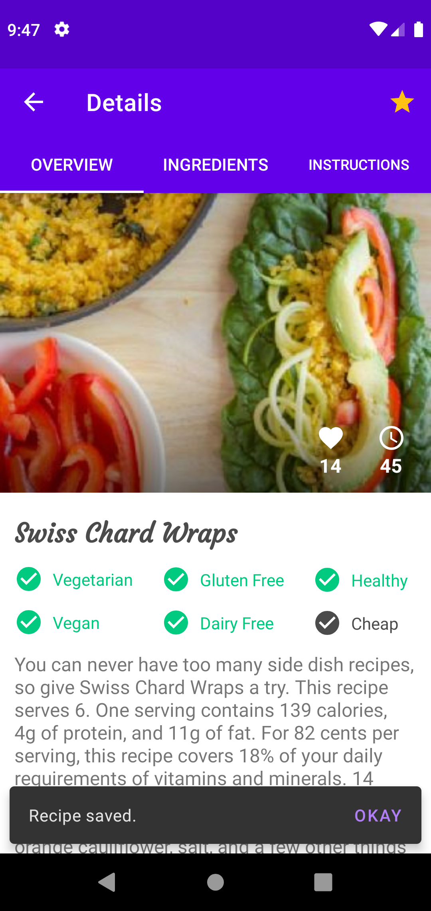
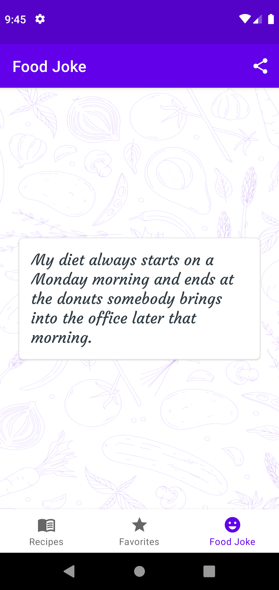

Android FOODY
=================

Modern food recipes application using kotlin coroutines and retrofit2.

Introduction
------------

Kotlin Coroutines: A coroutine is a concurrency design pattern that you can use on Android to simplify code that executes asynchronously. 
Retrofit: Retrofit is type-safe REST client for Android and Java which aims to make it easier to consume RESTful web services. ... Retrofit automatically serialises the JSON response using a POJO(Plain Old Java Object) which must be defined in advanced for the JSON Structure.

Android FOODY demonstrates utilizing these components to create a simple food recipe app.


In this application user can view recipe, add them in local storage, review them.
There is also filter search, instructions of recipe and overview of the recipes and food joke fragment.
It also support dark android dark theme.


Getting Started
---------------
This project uses the Gradle build system. To build this project, use the
`gradlew build` command or use "Import Project" in Android Studio.

There are two Gradle tasks for testing the project:
* `connectedAndroidTest` - for running Espresso on a connected device
* `test` - for running unit tests

For more resources on learning Android development, visit the
[Developer Guides](https://developer.android.com/guide/) at
[developer.android.com](https://developer.android.com).

### spoonacular API


FOODY uses the [spoonacular API](https://spoonacular.com/food-api) to load recipes, images, instructions,food type and food joke. To use the API, you will need to obtain a free  API key or open an paid account.

Once you have the key, change the constant `API_KEY` in `Constant.kt` file that can be found in
`~app\src\main\java\com\example\foody\util` path.

```
const val API_KEY = "[Your API_Key]"
```


Screenshots
-----------

<table>
  <tr>
    <td>View recipes</td>
     <td>Overview</td>
     <td>Instructions</td>
  </tr>
  <tr>
    <td></td>
    <td></td>
    <td></td>
  </tr>
  
   <tr>
    <td>Ingredients</td>
     <td>Filter meal search</td>
     <td>Search</td>
  </tr>
  <tr>
    <td></td>
    <td></td>
    <td></td>
  </tr>
  
   <tr>
    <td>Favorites recipes</td>
     <td>Save rcipes</td>
     <td>food jokes</td>
  </tr>
  <tr>
    <td></td>
    <td></td>
    <td></td>
  </tr>
  </table>
  
  
  

Libraries Used
--------------
* [Foundation][0] - Components for core system capabilities, Kotlin extensions and support for
  multidex and automated testing.
  * [AppCompat][1] - Degrade gracefully on older versions of Android.
  * [Android KTX][2] - Write more concise, idiomatic Kotlin code.
  * [Test][4] - An Android testing framework for unit and runtime UI tests.
* [Architecture][10] - A collection of libraries that help you design robust, testable, and
  maintainable apps. Start with classes for managing your UI component lifecycle and handling data
  persistence.
  * [Data Binding][11] - Declaratively bind observable data to UI elements.
  * [Lifecycles][12] - Create a UI that automatically responds to lifecycle events.
  * [LiveData][13] - Build data objects that notify views when the underlying database changes.
  * [Navigation][14] - Handle everything needed for in-app navigation.
  * [Room][16] - Access your app's SQLite database with in-app objects and compile-time checks.
  * [ViewModel][17] - Store UI-related data that isn't destroyed on app rotations. Easily schedule
     asynchronous tasks for optimal execution.
  * [WorkManager][18] - Manage your Android background jobs.
* [UI][30] - Details on why and how to use UI Components in your apps - together or separate
  * [Animations & Transitions][31] - Move widgets and transition between screens.
  * [Fragment][34] - A basic unit of composable UI.
  * [Layout][35] - Lay out widgets using different algorithms.
* Third party and miscellaneous libraries
  * [Glide][90] for image loading
  * [Hilt][92]: for [dependency injection][93]
  * [Kotlin Coroutines][91] for managing background threads with simplified code and reducing needs for callbacks

[0]: https://developer.android.com/jetpack/components
[1]: https://developer.android.com/topic/libraries/support-library/packages#v7-appcompat
[2]: https://developer.android.com/kotlin/ktx
[4]: https://developer.android.com/training/testing/
[10]: https://developer.android.com/jetpack/arch/
[11]: https://developer.android.com/topic/libraries/data-binding/
[12]: https://developer.android.com/topic/libraries/architecture/lifecycle
[13]: https://developer.android.com/topic/libraries/architecture/livedata
[14]: https://developer.android.com/topic/libraries/architecture/navigation/
[16]: https://developer.android.com/topic/libraries/architecture/room
[17]: https://developer.android.com/topic/libraries/architecture/viewmodel
[18]: https://developer.android.com/topic/libraries/architecture/workmanager
[30]: https://developer.android.com/guide/topics/ui
[31]: https://developer.android.com/training/animation/
[34]: https://developer.android.com/guide/components/fragments
[35]: https://developer.android.com/guide/topics/ui/declaring-layout
[90]: https://bumptech.github.io/glide/
[91]: https://kotlinlang.org/docs/reference/coroutines-overview.html
[92]: https://developer.android.com/training/dependency-injection/hilt-android
[93]: https://developer.android.com/training/dependency-injection


